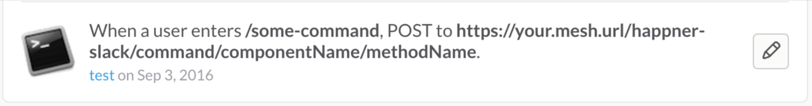
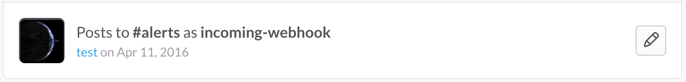

[](https://www.npmjs.com/package/happner-slack) [](https://travis-ci.org/happner/happner-slack)

# happner-slack

In progress.

Currently implements only `/commands` and `webhook` integrations from/to slack.

* The `/commands` allow commands entered on slack to run mesh exchange methods that reply back to slack.
* The `webhook` allows for the mesh to post messages to slack.

## Todo

* Security solution. Command calls from slack are relayed by a middleware function which means the actual exchange calls are secondary/internal calls run as admin. It would be nice if the team-domains/users from slack could be integrated with/mapped to happn users.
* Support multiple (named) webhooks.

## Setup in mesh

NB: slack **requires https** server with """valid""" cert (not self-signed)

```javascript
...
components: {
  'happner-slack': {
    $configure: function (defaultConfig) {
      var config = defaultConfig.component.config;
      
      // supports multiple tokens so that multiple slack commands can post here
      config.command.tokens.push('SLACKTOKEN1');
      config.command.tokens.push('SLACKTOKEN2');
      
      // note: if process.env.SLACK_COMMAND_TOKENS = 'token1,token2,...'
      //       then those will be pre-loaded into defaultConfig
      
      config.webhook.url = 'https://hooks.slack.com/services/.../.../...'
      
      return defaultConfig;
    }
  },
  'componentName': {
    // another component (that happner-slack relays /commands to)
  }
},
...
```

## Setup on slack

Create any number of `/command` integrations in slack resulting approximately as follows:



* Note that the `component/method` to run is encoded into the command's post url.
* Contained in each command setup is a `token` that should go into the mesh config described above.

Create a `webhook` integration in slack resulting approximately as follows:



* Contained in the slack setup is a `url` that should go into the mesh config described above.
* Note that although the happner-slack component supports only one webhook config, messages can be posted to any (public) channel in the team-domain using the same webhook.

(missing images? see [github readme](https://github.com/happner/happner-slack))

## Slack compatible exchange methods

In the above setup, execution of `/some-command` in slack will call `exchange.componentName.methodName(payload, callback)` with the command payload as follows:

```js
{
  team_id: "...",
  team_domain: "...",
  channel_id: "...",
  channel_name: "...",
  user_id: "...",
  user_name: "...",
  command: "/some-command",
  text: "additional parameters as text"
}
```

It is up to `exchange.componentName.methodName(payload, callback)` to callback with a slack compatible response as follows:

```js
callback(null, {
  // response_type: "ephemeral", // only caller sees command response
  response_type: "in_channel", // everybody sees command response
  text: "Some response text.",
  attachments: [
    {
      text: "Additional text."
    }
  ]
});
```

## Posting messages to slack using the webhook

Post messages from other mesh components via `$happn.exchange`.

```js
var message = {
  text: "Some text",
  // channel: "#general", // post to alternative (public) channel in the team-domain
  // username: "bob the bot", // post as alternative user
  // icon_emoji: ":earth_africa:" // post with alternative icon
}

$happn.exchange['happner-slack'].post(message)  
  .then(function() {
    // success
  })
  .catch(function(error) {
    // failed
    
    // response from slack if "Error: slack api error"
    // error.statusCode
    // error.body
  });
```

[slack message formatting](https://api.slack.com/docs/message-formatting)
[emoji_icons](http://unicodey.com/emoji-data/table.htm)
