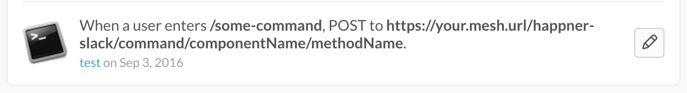

[](https://www.npmjs.com/package/happner-slack) [](https://travis-ci.org/happner/happner-slack)

# happner-slack

In progress.

Currently implements only `/command` integrations from slack.

## Todo

* Security solution. Command calls from slack are relayed by a middleware function which means the actual exchange calls are secondary/internal calls run as admin. It would be nice if the team-domains/users from slack could be integrated with/mapped to happn users

## Setup in mesh

NB: slack **requires https** server with """valid""" cert (not self-signed)

```javascript
...
components: {
  'happner-slack': {
    $configure: function (defaultConfig) {
      var config = defaultConfig.component.config;
      config.command.token = 'SLACKTOKEN';
      // supports only one token, all slack commands sent to this mesh will need to use this token
      return defaultConfig;
    }
  },
  'componentName': {
    // another component (that happner-slack relays /commands to)
  }
},
...
```

## Setup on slack

Create a `/command` integration in slack resulting as follows:



Note that the `component/method` to run is encoded into the command's post url.

## Slack compatible exchange methods

In the above example execution of `/some-command` in slack will call `exchange.componentName.methodName(payload, callback)` with the command payload as follows:

```js
{
  team_id: "...",
  team_domain: "...",
  channel_id: "...",
  channel_name: "...",
  user_id: "...",
  user_name: "...",
  command: "/some-command",
  text: "additional parameters as text"
}
```

It is up to `exchange.componentName.methodName(payload, callback)` to callback with a slack compatible response as follows:

```js
callback(null, {
  // response_type: "ephemeral", // only caller sees command response
  response_type: "in_channel", // everybody sees command response
  text: "Some response text.",
  attachments: [
    {
      text: "Additional text."
    }
  ]
});
```
